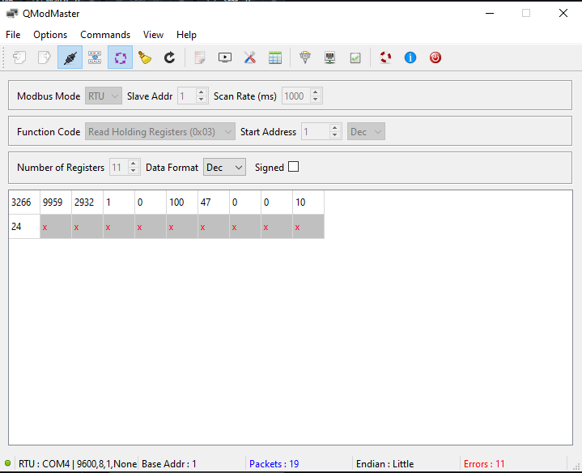

# STM32 FreeRTOS RS485 Modbus BME280 Sensor Node

FreeRTOS-based industrial RS485 Modbus RTU environmental sensor node using STM32F103C8T6, BME280 and MAX485.

This project reads temperature, pressure and humidity data from a BME280 sensor over I2C and exposes the measurements through Modbus RTU holding registers over an RS485 bus. The firmware is built with STM32 HAL, CMSIS-RTOS v2 / FreeRTOS, and implements Modbus RTU frame parsing, CRC16 validation, dynamic register response generation and exception handling.

## Features

* STM32F103C8T6 Blue Pill based embedded firmware
* FreeRTOS task-based architecture
* BME280 temperature, pressure and humidity sensor over I2C
* RS485 communication using MAX485 transceiver
* Modbus RTU slave implementation
* Function Code 03: Read Holding Registers
* Dynamic holding register response based on requested start address and quantity
* Modbus CRC16 validation
* Modbus exception response handling
* Mutex-protected shared holding register map
* Device status, uptime and diagnostic counter registers

## Hardware Used

* STM32F103C8T6 Blue Pill
* BME280 sensor module
* MAX485 RS485 transceiver module
* USB-RS485 adapter
* QModMaster for Modbus RTU testing

## FreeRTOS Task Structure

| Task       | Purpose                                                      |
| ---------- | ------------------------------------------------------------ |
| SensorTask | Reads BME280 sensor data and updates sensor registers        |
| ModbusTask | Handles Modbus RTU requests and sends RS485 responses        |
| StatusTask | Updates device status, firmware version and uptime registers |

## Modbus Holding Register Map

| Register | Description           | Scale             |
| -------- | --------------------- | ----------------- |
| 0        | Temperature           | value / 100 = °C  |
| 1        | Pressure              | value / 10 = hPa  |
| 2        | Humidity              | value / 100 = %RH |
| 3        | Device Status         | 1 = OK            |
| 4        | Error Code            | 0 = No error      |
| 5        | Firmware Version      | 100 = v1.00       |
| 6        | Uptime Seconds        | seconds           |
| 7        | CRC Error Count       | count             |
| 8        | Invalid Request Count | count             |
| 9        | Modbus Request Count  | count             |
| 10       | Sensor Read Count     | count             |

## Error Code Register

| Value | Meaning                       |
| ----- | ----------------------------- |
| 0     | No error                      |
| 2     | Invalid function              |
| 3     | Invalid address               |
| 4     | Invalid quantity / data value |

## RS485 / MAX485 Wiring

| STM32F103C8T6  | MAX485     |
| -------------- | ---------- |
| PA9 USART1_TX  | DI         |
| PA10 USART1_RX | RO         |
| PA8 GPIO       | DE and /RE |
| 3.3V           | VCC        |
| GND            | GND        |

| MAX485 | USB-RS485 Adapter |
| ------ | ----------------- |
| A      | A                 |
| B      | B                 |
| GND    | GND               |

## BME280 Wiring

| STM32F103C8T6 | BME280 |
| ------------- | ------ |
| PB6 I2C1_SCL  | SCL    |
| PB7 I2C1_SDA  | SDA    |
| 3.3V          | VCC    |
| GND           | GND    |

## QModMaster Test Setup

* Modbus Mode: RTU
* Baud Rate: 9600
* Data Bits: 8
* Parity: None
* Stop Bits: 1
* Slave Address: 1
* Function Code: Read Holding Registers (0x03)
* Start Address: 1
* Number of Registers: 11
* Base Address: 1

## Modbus Exception Handling

The firmware supports Modbus exception responses for invalid requests:

| Condition                 | Exception                                 |
| ------------------------- | ----------------------------------------- |
| Unsupported function code | Illegal Function                          |
| Invalid register address  | Illegal Data Address                      |
| Invalid quantity          | Illegal Data Value                        |
| CRC error                 | No response, CRC error counter increments |

## Project Status

The project has been tested using QModMaster over a USB-RS485 adapter. The STM32 responds to valid Modbus RTU holding register requests and returns Modbus exception frames for unsupported or invalid requests.

## Demo Screenshots
### Register Read (ie 11)

